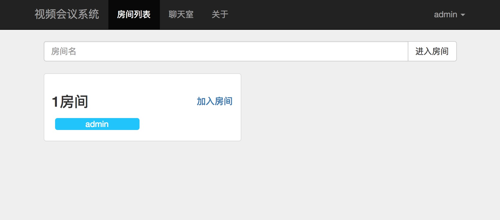
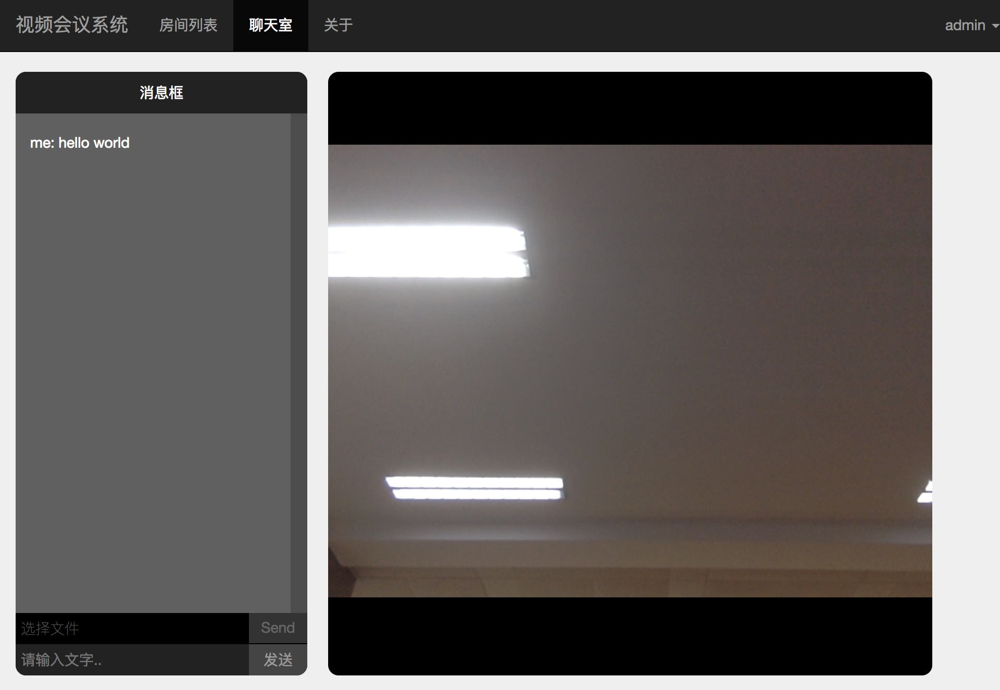

# 一个简单的SkyRTC示例

## 简介

这是一个使用 WebRTC 搭建浏览器中音频、视频、文字聊天室的Demo




## 安装和使用

确保使用前本地有 Node.js , npm 和 git 环境，安装 Mongodb 数据库并打开服务。

```bash
git clone https://github.com/imu-hupeng/SkyRTC.git
cd SkyRTC
npm install
```

```bash
npm run start
```

如果上述命令报错，请尝试：

```bash
sudo node server.js
```

之后访问 [https://localhost/addAdmin](https://localhost/addAdmin) 创建用户，注意这里使用的 https，如果提示 “您的连接不是私密连接”，请点击 “高级” -> “继续前往localhost（不安全）”。

创建用户后就可以在 [https://localhost/](https://localhost/) 登陆并使用本系统了。

## 功能说明

支持划分房间的在线音频、视频、文字聊天，提供房间内文件共享功能

## 参考项目

[SkyRTC项目](https://github.com/LingyuCoder/SkyRTC)

[SkyRTC-client项目](https://github.com/LingyuCoder/SkyRTC-client)
